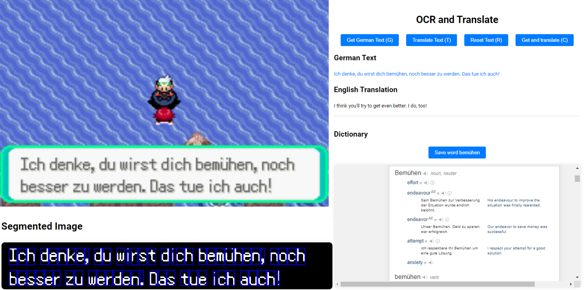
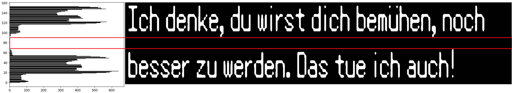
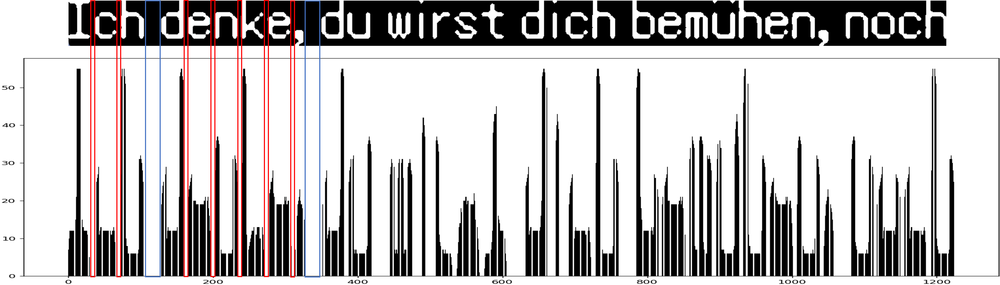

 

# VIDEOGAME OCR WITH TRANSLATION

In this project, I wanted to have some fun playing my favourite Pokémon videogame while learning German and some computer vision (pretty complete, isn't it?). The character recognition is performed using an OCR mechanism that I built from scratch. Since the videogame I chose is very uniform regarding the test display (the main text body always appears in the same part of the window, and with the same font) I achieved better results with a simple homemade OCR than the available OCR systems like [easyocr](https://www.jaided.ai/easyocr/) or [pytesseract](https://pypi.org/project/pytesseract/). The character extraction is based on the histograms of the binary image that is captured in the desired region. 

After getting all the characters, the translation is performed using the [transformers](https://huggingface.co/docs/transformers/es/index) library of [HuggingFace](https://huggingface.co/), which allows to select the original and translation language (in our case, German to English). For the translation to be correct, we also need the original text to be correct, and this is why I decided to use my own OCR given the simplicity of the problem.

Finally, the results are shown in a webpage that interacts with the application using [Flask](https://flask.palletsprojects.com/en/3.0.x/). The webpage displays the extracted text and the translated text (see image above). It has 4 buttons (and their shortcuts for keyboard):

- Get German Text (G): Gets the german text (without translation) to accumulate the text in a buffer. This is useful if the videogame displays incomplete sentences and we want to accumulate text before translating all of it.

- Translate Tet (T): Translated the accumulated text so far.

- Reset Text (R): Resets the buffer of text to restart collection and translation.

- Get and translate (C): Does everything at the same time. It extracts and translates the text currently appearing in the screen.

Below the buttons, qwe have both the German Text and the English Translation. The German text is clickable, so if we click on a word, it will open a dictionary page showing the translation and usage of that word. For this, I embedded an Iframe that calls [Linguee](https://www.linguee.com/german-english), which provides free usage. Also, a new button to save the word in a file is enabled to have a list of translated words in a .txt!

Finally, the segmented binary image with the text is shown. This is mostly for debugging purposes and visual performance evaluation.

# DESCRIPTION OF THE APP

The app consists of several stages. The first 

1) *Character segmentation* reads a section of the image, binarizes it and then gets the characters based on the vertical and horizontal histograms. This is performed in `ocr_german.py`.
2) *Character recognition* reveals the identity of each image. To do this, we need a dataset of ground truth character images to compare against. First, I considered using some traditional computer vision techniques such as HOG or feature matching. However, I saw that they were not totally reliable, so I ended up using a simple neural network. The training is performed in `cnn_train.py`, while the inference is performed in `ocr_german.py`.
3) *Translation*, for which we use a [transformers](https://huggingface.co/docs/transformers/es/index). It is performed in `translator.py`.
4) *Webpage* update to display the information. The html and CSS code are in `templates` and `static`, respectively. The [Flask](https://flask.palletsprojects.com/en/3.0.x/) app is in `main_app.py`, which is the file that has to be launched to run the whole app (once it is trained).

The other file is `params.py` that saves some important parameter that will need to be changed since they are specific for my setup.

## Character segmentation

The first step is to select the region of the image to read from (where the characters are located). This region has to isolate the characters from the rest of the image, and the background within the selected region has to contrast with the color of the characters, since the method relies on the binarization of the image. In `params.py`, the region of the image is the first parameter, stating the x, y coordinates of the extreme point, and the width and height of the region.  The parameter `threshold_binary` adjusts the binarization threshold. The resulting image is normalized, such that the characters will have a "1" in the image, while the background will have a "0".

The next step is the extraction of the vertical histogram to separate the lines of characters. Intuitively, a line occurs when the vertical histogram has valleys (0 values between high values). We have two values in `params.py` to account for this:

- `min_zeros_between_lines` declares how many consecutive 0s in a histogram we need to encounter to consider it a different line.
- There are characters in German that have part of the character separated from the main body of the character, such as the umlauts (ä, ü), or the letter "i". We run the risk that the dots fall in separate lines. For that reason, we consider that a part of the image can be a separate line only if it has enough entity (a minimum number of nonzero elements in its histogram). This is represented by `min_nonzeros_line`.

 

Then, for each detected line, we separate the characters following the same methodology but using the horizontal histograms. For this, we set the `min_zeros_between_characters` for the minimum space between characters and the `min_zeros_space` to detect spaces:

 

If the number of zeros exceeds `min_zeros_space`, then the app will add a space after the last character. After this step, we'll have all the images of characters and the position of the spaces!

## Character recognition (OCR)

My first try was to collect one sample of every character of the game and extract some descriptors like [HOG](https://machinelearningmastery.com/opencv_hog/). However, I found out that having just one sample in my "dataset" was not representative enough since there were little variations among different samples of the same character that sometimes caused errors when matching the features of the query image against the dataset. For that reason, I decided to collect more data and train a very simple neural network. 

Regarding the data collection, there is a method in `ocr_german.py` called `save_characters` where you manually enter the text appearing in the image, and the algorithm performs the segmentation of the characters as explained before, and assigns to each character the entered text. This is stored in the folder given by the parameter `folder_chars` (in `params.py`). The characters are stored in subfolders with the same name of the character (see, in the repository, the `chars_german_cnn` folder). However, some special characters required different names (such as the character in German ß). For those characters, we created a mapping through `chars_dict`, also in `params.py`, to save the files with an alias name, given by the values of the dictionary.

The training occurs in `cnn_train.py` and, as expected, achieves accuracy of 100%. The CNN is composed of convolutional layers and has a preprocessing step consisting of a letterbox to resize the image to `size_characters` (also in `params.py`) while keeping the aspect of the image (this is more accurate than directly resizing the image to the squared shape, which would severely distort the images that are not squared). The model weights will be stored in the folder `save_cnn_folder` and with name `save_cnn_file` (also in `params.py`)

After training the neural network and saved the weights, we perform inference in `ocr_german.py` as part of the OCR mechanism.

## Webpage

The webpage does not have any technical issues. The `main_app.py` is the program that connects the webpage with the OCR class.

# STEPS TO USE

There are three fundamental steps that must be done before using the APP. First, you have to collect enough data to train the CNN, using mainly the `ocr_german.py` directly. After collecting the data, you have to train the OCR NN using the `cnn_train.py` program. Finally, you can run the whole system for inference and translation using the `main_app.py`.

## Data collection

For the data collection, it's very important to adapt the parameters in `params.py`, which I have been explaining along the document. The best way to adapt parameters related to the binarization and histogram is to visualize, step by step, the image. This can be accomplished with the functions `plot_region`, `plot_vertical_histogram`, `plot_horizontal_histogram`, and `plot_segmentation`. They can be executed uncommenting their call in `ocr_german.py`.

Once we are happy with the segmentation when calling `plot_segmentation`. We have to provide ground truth, which is accomplished using the `save_characters` function. The sentence you pass must match the one you are segmenting. I spent about 1-2 hours collecting the data, with consecutive calls to `ocr_german.py` with the `save_characters` activated.

Finally, you can also see the characters stored so far using the `ranking_character` method. It is normal to have an imbalanced dataset because some character appear much more often than others. I tried to have at least 5-10 samples of each, although by that time I already have +400 samples of the most common characters. This didn't hurt the neural network performance. 

## Neural network training

To train the NN, just run `cnn_train.py` after collecting enough data. You can define your own NN structure. In my case, a very small and simple network was enough.

## Translation

Using the [transformers](https://huggingface.co/docs/transformers/es/index) library, it's very easy to translate from one language to another, just check if the languages you want to use are defined by the library and you should just change the line: `self.translator = pipeline("translation_de_to_en", model="Helsinki-NLP/opus-mt-de-en")` in `translator.py`.

## Main app

One the CNN is trained, running the main app will launch everything. Every time you request data from the server, the image will undergo the whole pipeline of segmentation, recognition and translation, sending all this data via the [Flask](https://flask.palletsprojects.com/en/3.0.x/) app.

# ADDITIONAL CONSIDERATIONS

There are a couple more functionalities that the app handles

- If the last character of a line is a hyphen, it is most likely that the same word has been split in two lines, so the app unifies both segments and deletes the hyphen. If the last character is not a hyphen, then the first word of the next line is separated with a space. If you are labeling this image with the method `save_characters`, you should omit this hyphen.

- There is also a special character in my game that appears at the end of some messages indicating that the message is incomplete and will continue when you press the forward button in the videogame. I called this character "cursor" and, for labeling, I just added a final space in the `save_characters` when the message contains this cursor (since that character does not exist in the keyboard). This way, adding this final space in a sentence means that it contains a cursor in the videogame, which is convenient because the space won't hurt the translation.

# LIMITATIONS

- The main limitation is the restricted usage in settings where the text always has the same position and font, and is well contrasted from the background.
- Also, the character should be clearly separable using the histogram. Italic fonts or others that do not have at least 1 pixel of difference between two characters are not valid. For these, some other methods (e.g., based on contours rather than histogram) should be tested. In my case, I only found trouble with the character 'Q' (capital letter). This character cannot be segmented with this approach because the tail of the Q overlaps with the next character so the histogram does not perceive any 0 value. This can be fixed with some artifacts, but I preferred to leave the app clean since, luckily, Q is not a common letter.
- The individual translation of each word to save in a .txt file may face issues of lack of context (since the word is translated on its own), and it doesn't extract the stem or the main part of the word, rather it is translated "as is". Although the app does not save repeated words (and also disregards the upper-lower case of the word), it is true that any declension (which is very common in German) will form a new word, so many versions of the same word may be stored, and also the translator may struggle to give a proper translation because of it.
